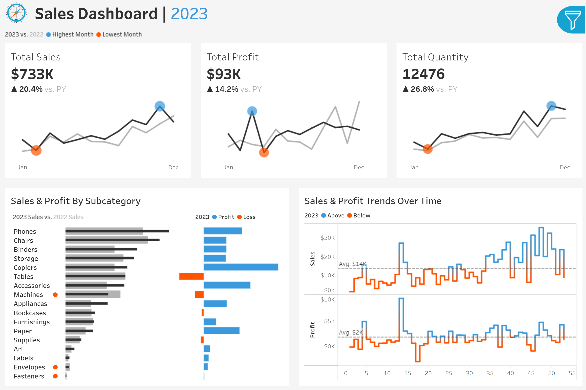

Company Sales Dashboard
=======================

Overview
--------

Tableau dashboard presenting core business KPIs (Total Sales, Profit, Quantity), YoY context, subcategory performance, and weekly trend lines with average references and interactive cross-filtering.

Live demo
---------

View on Tableau Public <https://public.tableau.com/REPLACE_WITH_YOUR_SALES_URL>_

Screenshot
----------

   Dashboard overview.

Notes
-----

- Workbook (`.twbx`) intentionally omitted.
- Dataset not included; this repo serves as a portfolio preview via screenshot + live link.

License
-------

This project is licensed under the MIT License - see the LICENSE <LICENSE>_ file for details.