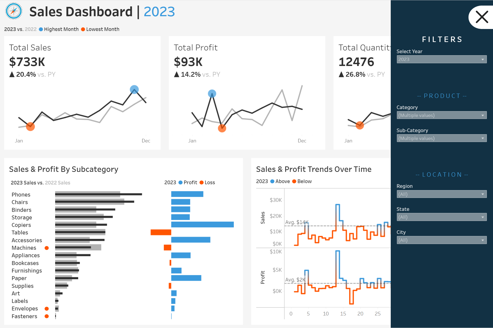

Company Sales Dashboard
=======================

Overview
--------

Tableau dashboard presenting core business KPIs (Total Sales, Profit, Quantity), YoY context, subcategory performance, and weekly trend lines with average references and interactive cross-filtering.

Live demo
---------

`View on Tableau Public <https://public.tableau.com/views/Sales_Dashboard_17173950986130/SalesDashboard?:language=en-US&:sid=&:redirect=auth&:display_count=n&:origin=viz_share_link>`_

Screenshots
-----------

.. figure:: images/dashboard.png
   :alt: Company Sales — Tableau dashboard (KPIs, YoY, subcategory bars, weekly trends)
   :width: 1200px

   Dashboard overview.

Notes
-----

- Workbook (`.twbx`) intentionally omitted.
- Dataset not included; this repo serves as a portfolio preview via screenshot + live link.

License
-------

This project is licensed under the MIT License - see the `LICENSE <LICENSE>`_ file for details.
